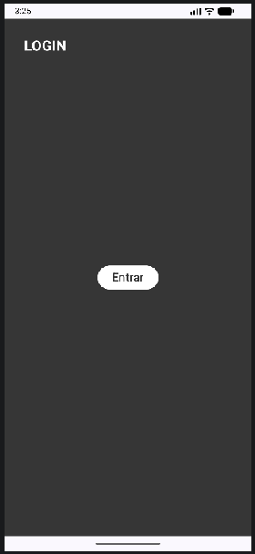
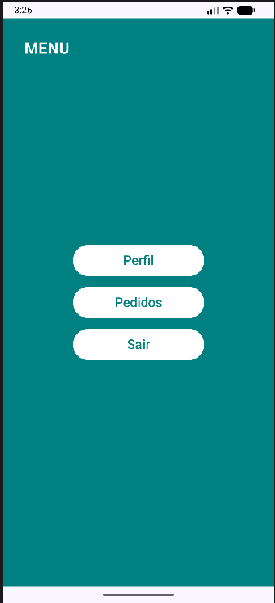
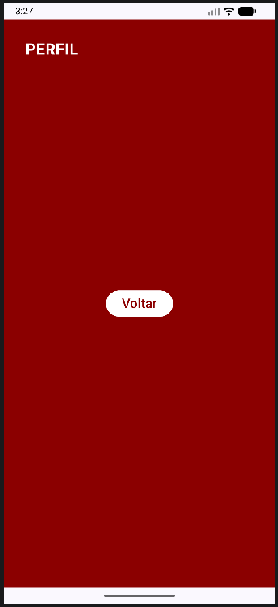
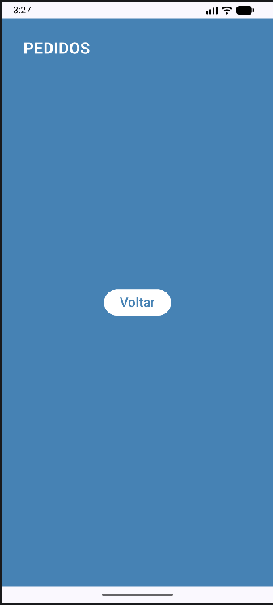

## projetopraticonavegacaoentretelas
Projeto para pratica de navegacao entre telas com Kotlin

### Print das telas Funcionado:
#### Tela Login:

#### Tela Menu:

#### Tela Perfil:

#### Tela Pedidos:

